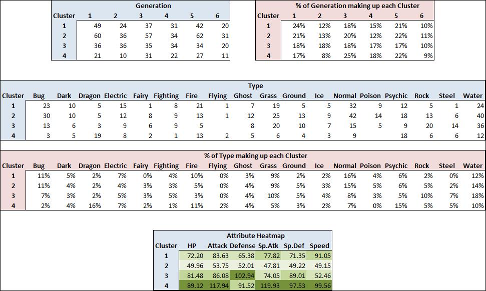

<style>
body {
text-align: justify}
</style>

```{r setup, include=FALSE}
knitr::opts_chunk$set(echo = FALSE, warning = FALSE, message = FALSE, fig.align="center")

# Packages
require(tidyverse)
require(GGally)
require(corrplot)
require(kableExtra)
require(prettydoc)
require(e1071)
require(factoextra)
require(writexl)

setwd("C:\\Users\\jcurt\\OneDrive\\College\\Sem 2\\MA4128 Data Modelling\\Project\\Pokemon-Analysis")
```

```{r}
# Reading in the data
data = read.csv("pokemon.csv")

# Convert 'Type' and 'Generation' to categorical variables
data[,2] <- as.factor(data[,2]); data[,9] <- as.factor(data[,9])
```

<center>
# Technical Report
</center>

### Exploratory Analysis
***

```{r, fig.width=8, fig.height=4}
# Converts our data to a dataframe for columns 3 to 8.
df <- tibble::as_tibble(data[,3:8])

# Code for creating Histograms for each numeric varible
df %>%
  gather(Attributes) %>%
  ggplot(aes(x=value, fill=Attributes)) +
  geom_histogram(colour="black", show.legend=FALSE) +
  facet_wrap(~Attributes, scales="free_x") +
  labs(x="Variables", y="Frequency",
       title="Pokemon Attributes - Histograms") +
  theme_bw()
```

The dataset we are considering consists of 800 Pokemon, each of which have a unique combination of battling statistics along with other characteristics. Our main objective is to identify what Pokemon exhibit similar battling characteristics. It should be noted that *Type* and *Generation* are the only categorical variables in this dataset. To begin analysing our data, we will look at a summary statistic for each of our non-categorical variables to determine if our data contains any abnormalities and if the data needs to be standardised.

```{r}
# Creates a summary
df.sum <- df %>%
  summarise_all(list(min = ~min(.), q25 = ~quantile(., 0.25), median = ~median(.), q75 = ~quantile(., 0.75), 
                      max = ~max(.), mean = ~mean(.), sd = ~sd(.))) 


# reshape the output for presentation in a table
df.sum %>% gather(stat, val) %>%
  separate(stat, into = c("var", "stat"), sep = "_") %>%
  spread(stat, val) %>%
  select(var, min, q25, median, q75, max, mean, sd) %>%
  kable() %>%
  kable_styling(full_width = F, bootstrap_options = c("striped", "hover", "condensed"), font_size = 14)
```

From this table there doesn't seem to be any abnormalities in our data and the variances don't vary massively although we will still standardise our data to ensure each variable is of equal weight when we look into creating clusters. We can also look at the histograms above for our data and use the ```ggpairs()``` function to create pairs plots for our numeric variables, which has the following output:


```{r, fig.width=8, fig.height=4}
ggpairs(data[,3:8]) + theme_minimal()
```

This can be interpreted to mean that whilst there are no strong associations in our data, we do have moderate associations between $\it Sp.Def$ and $\it Defense$ and $\it Sp.Def$ and $\it Sp.Atk$. There are also appears to be a few outliers in the data, although none seem to be of major significance.

<br>


### Standardise the data
***

To begin formally analysing our data we must first standardised the data. We achieve this by dividing each of the variables by their standard deviation, which results in each standard deviation being equal to one.

```{r}

StDev <- apply(df, 2, sd) # '2' is column index
std.df = sweep(df, 2, StDev, "/")

# Converts our data to a dataframe for columns 3 to 8.

# Creates a summary
df.sum <- std.df %>%
  summarise_all(list(min = ~min(.), median = ~median(.), max = ~max(.), mean = ~mean(.), sd = ~sd(.))) 


# reshape the output for presentation in a table
df.sum %>% gather(stat, val) %>%
  separate(stat, into = c("var", "stat"), sep = "_") %>%
  spread(stat, val) %>%
  select(var, min, median, max, mean, sd) %>%
  kable() %>%
  kable_styling(full_width = F, bootstrap_options = c("striped", "hover", "condensed"), font_size = 14)

```

We can now use this standardised dataset to carry out k-means clustering, which is a form of hierarchical clustering. A feature of a clustering solution in which we are interested in is the within group sum of squares (WGSS), which we will use to determine the number of clusters. We will use the k-means algorithm over the range $k = 1,..., 10$ clusters and we will record the WGSS for each value of $k$.

```{r, fig.width=8, fig.height=4}

WGSS = rep(0,10)

WGSS[1]	= (nrow(std.df)-1) * sum(apply(std.df, 2, var))

for(k in 2:10)
    WGSS[k] = sum(kmeans(std.df, centers = k , nstart=20)$withinss)

ggplot(data=as.data.frame(WGSS), aes(x=1:10, y=WGSS)) + xlab("Number of Clusters: k") + 
  ylab("WGSS") + theme_minimal() + geom_line() + geom_point() + xlim(1,10) + geom_text(aes(label=1:10),hjust=0, vjust=0)
```

We can determine the *elbow point* from our plot to be between 2 and 4, in this case we will choose 4 as the plot gradually tapers after 4. Below we see the number of Pokemon in each cluster and also the centers of each cluster.

```{r}
set.seed(4) # Set seed to ensure results stay consistent
cl = kmeans(std.df, center=4, nstart = 20)

# Creating the output below to show the number in each cluster and the centers of each
output <- cbind(as.matrix(table(cl$cluster)), cl$centers)
colnames(output)[1] <- "#"

output <- cbind(c(1:4), output); colnames(output)[1] <- "Cluster"
output %>%
  kable() %>%
  kable_styling(full_width = F, bootstrap_options = c("striped", "hover", "condensed"), font_size = 14)
```

From this output we can see that Cluster 2 has the most Pokemon and also the lowest scores. Cluster 4 has the lowest number of Pokemon yet has the highest scores in everything except $\it Defense$. Cluster 1 has high $\it HP$ but lower than average $\it Defense$ and Cluster 3 has lower than average $\it Speed$ but the highest value of $\it Defense$.

<br>


### Visualising the cluster solution
***

We can visualize the clusters using principal components where we take $\it Hp$ to be PC1 and $\it Attack$ to be PC2 as shown below. We can see that our clusters are reasonably distinguishable in this plot.

```{r, fig.width=8, fig.height=4}

# Calculate the principal components
pcs = df %>%
  princomp(cor=TRUE) # Principle components analysis of original data set, stored all the scores

# Set up a dataframe containing the first 2 PCs for plotting, the cluster membership and the Area label.
pc.soln = data.frame(PC1 = pcs$scores[,1], PC2 = pcs$scores[,2], cluster=as.factor(cl$cluster), state= data$Name)

ggplot(pc.soln, aes(x=PC1, y=PC2, colour=cluster)) + geom_point() + theme_minimal()+ xlab("PC1: HP") + ylab("PC2: Attack") +
  scale_colour_manual(values = c("red", "blue", "purple", "black")) + geom_text(label=data$Name , nudge_x = 0.25, nudge_y = 0.2) + theme_gray()

```

We can also further analyse our results if we export a data frame to excel which has an additional column defining each cluster and another column defining the average of our standardised numeric variables (to objectively determine the best Pokemon). We find a summary of our results from that table to be as follows which shows the amount of each Generation and the amount of each Type in our Clusters.

```{r}
# Code for creating a new data frame with each of the clusters
Cluster <- as.factor(cl$cluster)
dataClustered <- cbind(data,Cluster)

# Creates a new column for the standardised Average
dataClustered$StandardisedAverage <- rowMeans(std.df)

# Exporting the new data frame to excel
# write_xlsx(dataClustered,"C:\\Users\\Jack\\OneDrive\\College\\Sem 2\\MA4128 Data Modelling\\Project\\Pokemon Summary.xlsx")
```

```{r Excel Summary, out.width = '90%'}

```

We find the worst Pokemon to objectively be the following:

```{r}
head(arrange(dataClustered, StandardisedAverage))[-11] %>%
  kable() %>%
  kable_styling(full_width = F, bootstrap_options = c("striped", "hover", "condensed"), font_size = 11)
```

We find the best Pokemon to objectively be the following:

```{r}
tail(arrange(dataClustered, StandardisedAverage))[-11] %>%
  kable() %>%
  kable_styling(full_width = F, bootstrap_options = c("striped", "hover", "condensed"), font_size = 10)
```

<br>


### Conclusion
***

Upon further inspection using summaries from Excel to analyse each cluster we come to the conclusion that the Pokemon which have the best battling characteristics are *Legendary Pokemon* and *Final Evolution Pokemon*. From our analysis Cluster 4 contains the best overall Pokemon as it contains the most Legendary and Final Evolution Pokemon. Cluster 2 contains the worst overall Pokemon and it is therefore best to avoid choosing any pokemon from this cluster. Clusters 1 and 3 have similar values with 3 having the best overall $\it Defense$ values and 1 having the second best overall $\it Speed$ values. From our analysis it seems that no Generation stands out as having better overall Pokemon than the other Generations. The best Type appears to be Dragon, Psychic and Fire and the worst Type seems to be Bug and arguably Normal. Water seems to be the most diverse Type as it makes up roughly 14% of each cluster. We thus conclude that the best Pokemon are Legendary and Final Evolution Pokemon, the majority of which are in Cluster 4, and that it is best to obtain Dragon and Fire Type and avoid Bug Type if possible.

Each cluster can be summarised as follows:

* <span style="color:seagreen">Cluster 1</span>
Contains the third best overall Pokemon. Has the second highest values in $\it Sp. Atk$ and $\it Speed$. Mainly composed of Generation 1 and 5 with average amounts from the other Generations. Consists mainly of Normal, Water and Bug Type with notably lower than average amounts of Rock and Steel Type. We conclude that this cluster contains lighter and thus faster Pokemon although it lacks good $\it Defense$ and $\it HP$.

\vspace{.5pt}
* <span style="color:seagreen">Cluster 2</span>
Contains the worst overall Pokemon. Mainly composed of Generation 1, 3 and 5 with average amounts from the other Generations. Consists mainly of Normal, Water, Bug and Fire Type. We conclude that this cluster should be avoided if possible.

\vspace{.5pt}
* <span style="color:seagreen">Cluster 3</span>
Contains the second best overall Pokemon. Has the highest $\it Defense$ values and second highest values in everything else aside $\it Sp. Atk$ and $\it Speed$. Composed of a relatively equal amount of each Generation with the exception of Generation 6 which make up 10% of this Cluser. Consists mainly of Water, Rock and Grass Type with the highest percentage of Steel Type. We conclude that this cluster consists of heaver and thus slightly more powerful Pokemon that Cluster 1, although these Pokemon lack $\it Speed$ they still have an edge over Cluster 1.

\vspace{.5pt}
* <span style="color:seagreen">Cluster 4</span>
Contains the best overall Pokemon. Has the highest overall values in everything except $\it Defense$. Mainly composed of Generation 3 and 5 with a slightly lower than average amount of Generation 2. Consists mainly of Dragon, Psychic, Fire and Water Type with the lowest percentage of Bug Type and no Poison Type. We conclude that this cluster has the best overall Pokemon and it is therefore best to obtain any Pokemon from this cluster in order to have an advantage over the other clusters.

<br>


<center> <h1>Non-Technical Report</h1> </center>

```{r Charizard, out.width = '40%'}
knitr::include_graphics("charizard.jpg")
```

We began analysising the Pokemon data by looking at the *numeric* variables which are the variables that describe the battling characteristics of each Pokemon. We determined that because the variances (denoted *sd*) for each numeric variable were different from each other that we should *standardise* the data, which essentially means to divide each numeric variable by the *sd* value to ensure to that each variable is of equal weight. We did this as otherwise there would be more weight on variables with smaller variance such as $\it HP$. We used these standardised variables to carry out *k-means* clustering, which is an iterative partitioning clustering algorithm which divides the data into $k$ disjoint, non-overlapping groups such that observations within a group are similar and observations in different groups are different. We determined the optimal number of clusters to be $k = 4$, and as such we partitioned our data into 4 different clusters.

We could see that some clusters had better variable scores than others, which implied that Pokemon in one cluster had better scores than those in another. We could see that the average scores for each variable were higher in Cluster 4 than the other clusters and that Cluster 2 contained the worst overall scores for each variable, which suggests that it is best to avoid Pokemon contained in Cluster 2 and to seek out any Pokemon from Cluster 4. We also looked at a summary for the Generation and Type contained in each cluster and we came to the conclusion that Generation has no major bearing on how good a Pokemon's battling attributes will be. We did however conclude that the Bug Type appeared to be the worst and that Dragon and Psychic appeared to be the best Types in terms of battling attributes. In reality the defining factor as to why the Cluster 4 scores were far better than the others was because this cluster contained what are known as *Legendary Pokemon* and *Final Evolution Pokemon*, which are Pokemon that are rare and as such difficult to obtain.